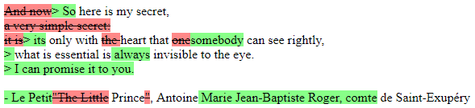

# php-diff
Text diff library for PHP

## Installation
```cmd
composer require yusitnikov/php-diff
```

## Usage
Create an instance of `LevenshteinDiffCalculator`. Arguments:
1. `string $separatorRegex` - separator RegEx that will split the strings into units.
   By default, strings will be split into letters.
2. `OperationCostCalculator $operationCostCalculator` - specify it to apply custom operation costs.
   By default, the cost for each operation (insert, delete, replace) will be 1.
3. `StringDiffCalculatorInterface $itemDiffCalculator` - diff calculator that would be applied when replacing a unit.

### Example 1. Simple use-case - calculate distance and diff letter by letter.
```php
use Chameleon\PhpDiff\LevenshteinDiffCalculator;

$s1 = 'Levenshtein';
$s2 = 'Einstein';

$differ = new LevenshteinDiffCalculator();
var_dump($differ->calcDistance($s1, $s2));
var_dump($differ->calcDiff($s1, $s2));
```

Output:
```
int(5)
class Chameleon\PhpDiff\StringDiffResult#14 (2) {
  public $distance =>
  int(5)
  public $diff =>
  array(5) {
    [0] =>
    class Chameleon\PhpDiff\StringDiffOperation#12 (2) {
      public $operation =>
      string(6) "DELETE"
      public $content =>
      string(4) "Leve"
    }
    [1] =>
    class Chameleon\PhpDiff\StringDiffOperation#13 (2) {
      public $operation =>
      string(6) "INSERT"
      public $content =>
      string(2) "Ei"
    }
    [2] =>
    class Chameleon\PhpDiff\StringDiffOperation#7 (2) {
      public $operation =>
      string(5) "MATCH"
      public $content =>
      string(2) "ns"
    }
    [3] =>
    class Chameleon\PhpDiff\StringDiffOperation#5 (2) {
      public $operation =>
      string(6) "DELETE"
      public $content =>
      string(1) "h"
    }
    [4] =>
    class Chameleon\PhpDiff\StringDiffOperation#4 (2) {
      public $operation =>
      string(5) "MATCH"
      public $content =>
      string(4) "tein"
    }
  }
}
```

The corresponding diff:
```diff
- Leve
+ Ei
ns
- h
tein
```

### Example 2. Complex differ - compare lines and words

```php
use Chameleon\PhpDiff\LevenshteinDiffCalculator;
use Chameleon\PhpDiff\OperationCostCalculator;

$s1 = 'And now here is my secret,
a very simple secret:
it is only with the heart that one can see rightly,
what is essential is invisible to the eye.

"The Little Prince", Antoine de Saint-Exupéry';

$s2 = '> So here is my secret,
> its only with heart that somebody can see rightly,
> what is essential is always invisible to the eye.
> I can promise it to you.

- Le Petit Prince, Antoine Marie Jean-Baptiste Roger, comte de Saint-Exupéry';
$lineDiffer = new LevenshteinDiffCalculator(LevenshteinDiffCalculator::SPLIT_WORDS_REGEX);
$textDiffer = new LevenshteinDiffCalculator(
    LevenshteinDiffCalculator::SPLIT_LINES_REGEX,
    (new OperationCostCalculator())->setReplaceDistanceCalculator($lineDiffer),
    $lineDiffer
);
$result = $textDiffer->calcDiff($s1, $s2);
```


